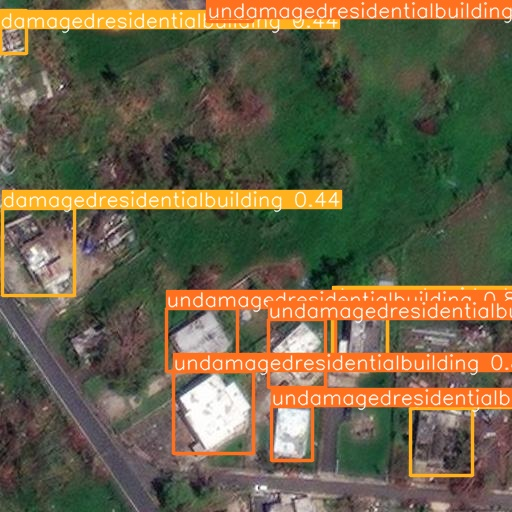

<a name="readme-top"></a>

<!-- PROJECT LOGO -->
<br />
<div align="center">
    

  <h3 align="center">Tropical Cyclone Damage Assessment</h3>

  <p align="center">
    A machine learning challenge to identify damaged and undamaged buildings from satellite imagery.
    <br />
    <a href="https://github.com/your_username/repo_name"><strong>Explore the docs »</strong></a>
    <br />
  </p>
</div>

<!-- TABLE OF CONTENTS -->
<details>
  <summary>Table of Contents</summary>
  <ol>
    <li>
      <a href="#about-the-challenge">About The Challenge</a>
      <ul>
        <li><a href="#built-with">Built With</a></li>
      </ul>
    </li>
    <li><a href="#challenge-structure">Challenge Structure</a></li>
    <li><a href="#getting-started">Getting Started</a></li>
    <li><a href="#usage">Usage</a></li>
  </ol>
</details>

<!-- ABOUT THE CHALLENGE -->
## About The Challenge

The EY Open Science Data Challenge 2024 presents an opportunity for participants to leverage high-resolution pre and post-event satellite imagery to assess the damage inflicted by tropical cyclones on coastal infrastructure.

The goal is to build a machine learning model capable of identifying and classifying buildings as 'damaged' or 'undamaged' across residential and commercial zones.

This project includes a demonstration notebook to serve as a starting point, utilizing YOLOv8 for object detection. 

<p align="right">(<a href="#readme-top">back to top</a>)</p>

### Built With

This project was built with the following frameworks and libraries:

* [Ultralytics YOLOv8](https://docs.ultralytics.com/)
* [OpenCV](https://opencv.org/)
* [LabelMe2Yolo](https://pypi.org/project/labelme2yolo/)
* [Rasterio](https://rasterio.readthedocs.io/)
* [GDAL](https://gdal.org/)

<p align="right">(<a href="#readme-top">back to top</a>)</p>

<!-- CHALLENGE STRUCTURE -->
## Challenge Structure

The project consists of annotated datasets, a YAML configuration file, and a trained YOLOv8 model. The file structure and preparation steps are thoroughly documented in the provided Jupyter Notebook, enabling participants to structure their own dataset and configuration for model training.

<p align="right">(<a href="#readme-top">back to top</a>)</p>

<!-- GETTING STARTED -->
## Getting Started

To replicate the demonstration or build upon it, follow the below steps:

### Prerequisites

Installation of necessary packages:

```sh
pip install ultralytics
pip install opencv-python-headless
pip install labelme2yolo
pip install rasterio
pip install GDAL

<!-- USAGE -->
For detailed examples on how to use the project, refer to the Jupyter Notebook included in the repository. Additionally, consult the Ultralytics Documentation for advanced usage of YOLOv8.

<p align="right">(<a href="#readme-top">back to top</a>)</p>
